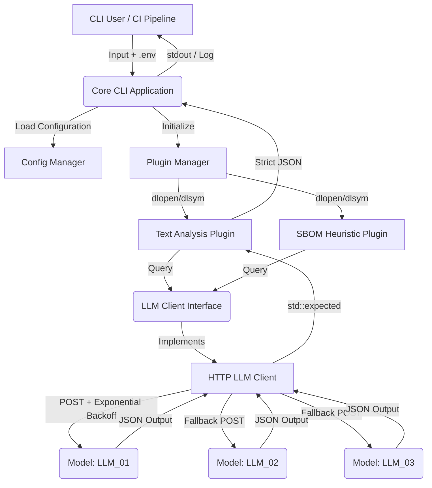

# AI Plugin System - Architektur

## Komponenten und Datenfluss

Das System besteht aus den folgenden Hauptkomponenten:

1. **CLI / Core Application (`src/main.cpp`)**: Initialisiert das System, liest Umgebungsvariablen (`.env`), instanziiert den HTTP-Client und lädt Plugins dynamisch.
2. **Plugin Interface (`include/plugin_type.hpp`)**: Definiert die Lebenszyklus-Hooks (`init`, `analyze`, `shutdown`) für alle Plugins.
3. **LLM Client Interface (`include/llm_client_type.hpp`)**: Definiert die Abstraktionsebene zur Kommunikation mit Large Language Models.
4. **HTTP LLM Client (`src/http_llm_client.cpp`)**: Konkrete Implementierung des LLM Clients mit Retry-Logik, Exponential Backoff, und Routing.
5. **Plugins (`plugins/`)**:
   - `text_analysis`: Analysiert Text (Sentiment, Kategorien).
   - `sbom_heuristic`: Analysiert SBOMs und Artefakte.

### Architekturdiagramm

## JSON Validierung und Structured Output

Plugins erhalten unstrukturierten oder strukturierten Text, formen daraus einen System Prompt, und erzwingen durch das LLM striktes JSON. 
Dieses Output-Format wird mit einem Schema verifiziert (in `data/schemas/`). Bei einem Schema-Bruch wird die Retry-Logik des HTTP-Clients (Exponential Backoff with Jitter) ausgelöst.

## Sicherheit und Secrets

- `OPENROUTER_API_KEY` und andere Secrets werden nur über `.env` oder Umgebungsvariablen geladen und existieren im RAM, niemals in Logs oder Dumps.
- Langfristig sollte eine Anbindung an HashiCorp Vault oder AWS Secrets Manager über das Config-Modul in Erwägung gezogen werden.
