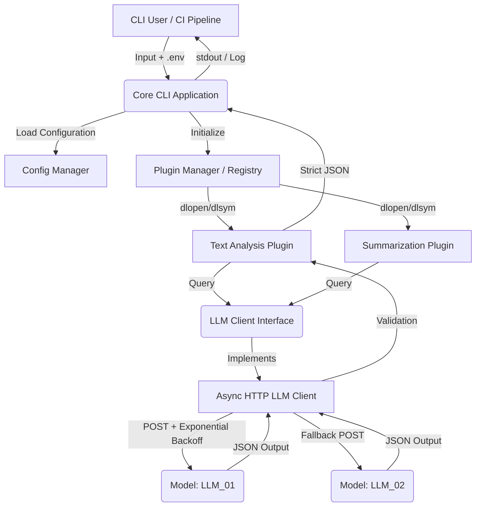

# AI Plugin System - Architecture

## Components and Data Flow

The system consists of the following main components:

1. **CLI / Core Application (`src/main.cpp`)**: Initializes the system, reads environment variables (`.env`), instantiates the HTTP client, and loads plugins dynamically via `PluginManager`.
2. **Plugin Interface (`include/plugin_type.hpp`)**: Defines lifecycle hooks (`init`, `analyze`, `analyze_stream`, `shutdown`) for all plugins.
3. **LLM Client Interface (`include/llm_client_type.hpp`)**: Defines the abstraction layer for communication with Large Language Models.
4. **Async HTTP LLM Client (`src/http_llm_client.cpp`)**: Concrete implementation of the LLM client using `libcurl` multi-interface for non-blocking I/O, supporting retries, exponential backoff, and model routing.
5. **BasePlugin (`include/base_plugin.hpp`)**: Abstract base class providing common functionality like schema loading and JSON validation.
6. **Plugins (`plugins/`)**: Specialized analysis and transformation modules.

### Architecture Diagram

## JSON Validation and Structured Output

Plugins receive input, construct a system prompt, and enforce strict JSON output from the LLM. 
The output is verified against a schema (stored in `data/schemas/`) using the `valijson` library before being returned.

## Security and Secrets

- `OPENROUTER_API_KEY` and other secrets are loaded only via `.env` or environment variables and reside in RAM, never in logs or traces.
- Future integration with Secret Managers (e.g., HashiCorp Vault) is planned.
